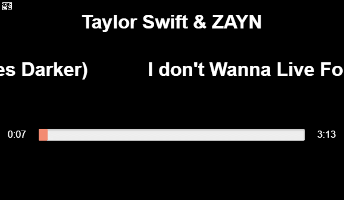

# react-marquee-double

This is React component which enable use <marquee> tag.
Instead of implementing the single effects, I did double.
Marquee is a tag which is extremely opposed to the use of MDN(https://developer.mozilla.org/ko/docs/Web/HTML/Element/marquee), but there is a need to write.
This marquee is recommended that the elements to flow must be used **when the width of elements is longer than the width of the screen.**

리액트에서 <marquee> tag를 사용할 수 있도록한 component입니다.
단순 <marquee>의 효과를 구현한 것이 아니라 double, 이중으로 흐르도록 하였습니다.
<marquee>는 MDN(https://developer.mozilla.org/ko/docs/Web/HTML/Element/marquee)에서 굉장히 사용을 반대하고 있는 tag이지만, 꼭 써야할 상황이 있습니다.
이 marquee component는 흐르게할 요소가 **반드시 화면의 너비보다 길때 사용하는것을 권합니다.**

## props

- ##### loop: bool
It is value that how much repeat moving.

- ##### space: number
It is the margin value between element and element.

- ##### step: number
It is the px value of how much it will move at 1 loop. (unit is px)

- ##### onStart: func
It is a function that executes when the element reach first place(default place).

- ##### interval: number
It is the value of how often the element move.

- ##### direction: string,
It is direction of element moving  
('left' or 'right')

- ##### autoStart: bool
It is the value of whether or not to start automatically.

- ##### delay: number
It is delay time value. It is used in delay().

- ##### onBounce: func
Not yet.

- ##### onEnd: func,
Not yet.

## state
- ##### left: number
It is css 'left' value of moving element. (unit is px)

- ##### right: number
It is css 'right' value of moving element. (unit is px)

- ##### singleWidth: number
It is width of the element you want to move. (unit is px)

- ##### moverWidth: number
It is width of the container element of you want to move. (unit is px) (Most cases, It is equal to containerWidth)

- ##### containerWidth: number
It is width of the container element of you want to move. (unit is px) (Most cases, It is equal to moverWidth)

- ##### viewPortWidth: number
It is width of viewPort

## method

- ##### start()
It is start of element moving

- ##### start()
It stops element

- ##### delay()
It is used for delay. First, stop and wait then start

- ##### move()
It moves the element.
